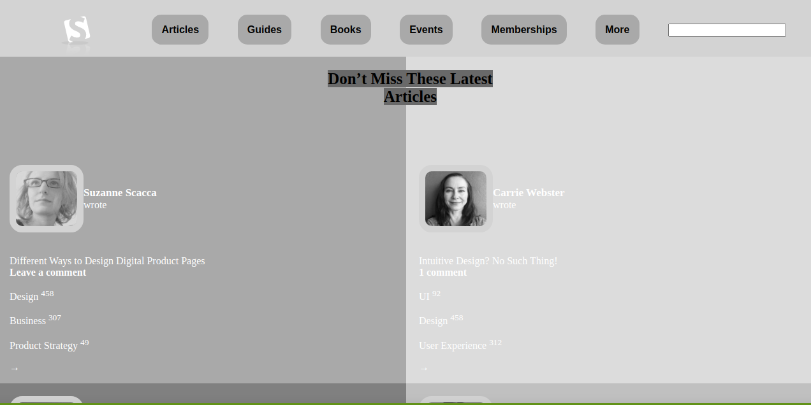

# Design-Teardown

> The Design-teardown page, had many fundaments such as on how to use an fonts, font wieght, colors etc.

The project was created based on an  site of smashingmagazine.com . The goal for this exercise is to start training  to think in terms of visual hierarchy, typography and design principles.
## Built With

- HTML5
- CSS3

## Live Demo

[Live Demo Link](https://rawcdn.githack.com/Jarfsoft/Design-Teardown/38b5bd817cf4046cc808a68ac63d387d6fc0dc69/index.html)

## Getting Started

**This project was created for the sole purpose of learning how to use CSS gradient  the job is to create a grayscale heat map of the website that indicates which elements have the greatest weight in the visual hierarchy..**

To get a local copy up and running follow these simple example steps.

### Prerequisites
Computer running Mac OS, Windows, or Linux Ubuntu.
Internet browser: Firefox, Google Chrome, Opera...

### Setup
Download the code or copy the git repository to your computer.

### Usage
Run the index.html file.

### Run tests
Linters errors

## Authors

👤 Juan Andrés Raudales Flores

- GitHub: [@Jarfsoft](https://github.com/Jarfsoft)
- Twitter: [@Jarfsoft](https://twitter.com/Jarfsoft)
- LinkedIn: [Juan Raudales Flores](https://www.linkedin.com/in/juan-raudales-flores-7b0a3b113/)

👤 **Mir Rawshan Ali**

- GitHub: [@sumon0002009](https://github.com/sumon0002001)
- Twitter: [@sumon0002009](https://twitter.com/Sumon0002009)
- LinkedIn: [Mir Rawshan Ali](https://www.linkedin.com/in/mir-rawshan-ali-27b6a5198/)

## 🤝 Contributing

Contributions, issues, and feature requests are welcome!

Feel free to check the [issues page](https://github.com/Jarfsoft/Design-Teardown/issues)

## Show your support

Give a ⭐️ if you like this project!

## Acknowledgments

- Hat tip to anyone whose code was used
- Inspiration
- New York Times

