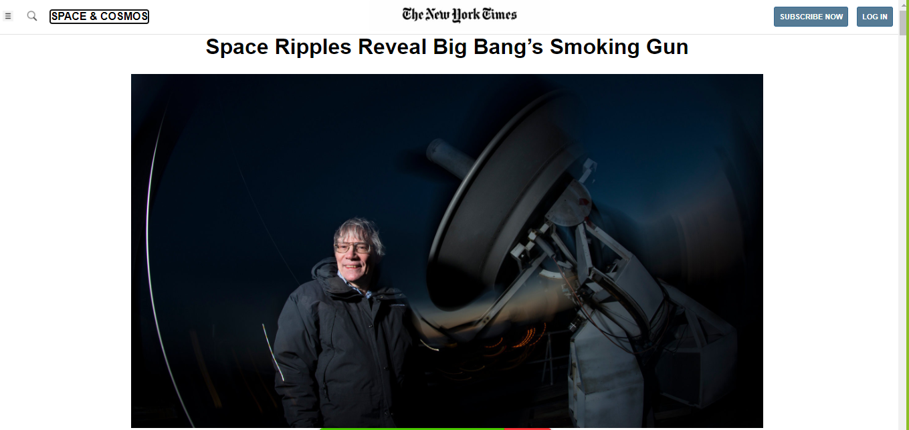

# Positioning and Floating Elements project Microverse

> We are Microverse students doing some basic HTML and CSS project. We created a basic HTML Structure based on the New York Times article page.

We created a fixed position nav-bar with two icons a link, the NYT logo and two buttons, we use 2 different sizes for the body fo the page, we also use a aside tag for the editor´s pick section on the rigth side, at the end of the page we use a grid to organize better the more articles section. 

## Built With

- HTML
- CSS

## Live Demo

- https://rawcdn.githack.com/Jarfsoft/Positioning-and-Floating-Elements/b5064ac365167f07fdc1b1bc4976be92e8529e34/index.html

## Getting Started

To get a local copy up and running follow these simple example steps.

Clone the project repository by typing the command below

- git clone https://github.com/Jarfsoft/Positioning-and-Floating-Elements/tree/nyt-article

After that enter on the directory of the cloned repository
- cd Positioning-and-Floating-Elements

To see how it looks like open the index.html file on your browser

## Authors

👤 **Julián**

- GitHub: [@julian3493](https://github.com/julian3493)
- Twitter: [@JulianR16893833](https://twitter.com/JulianR16893833)
- LinkedIn: [LinkedIn](https://www.linkedin.com/in/juli%C3%A1n-ricardo-ramos-arevalo-3868ba135/)

👤 **Juan Andres**

- GitHub: [@jarfsoft](https://github.com/jarfsoft)
- Twitter: [@jarfsoft](https://twitter.com/jarfsoft)
- LinkedIn: [LinkedIn](https://www.linkedin.com/in/juan-raudales-flores/)

## 🤝 Contributing

Contributions, issues, and feature requests are welcome!

Feel free to check the [issues page](issues/).

## Show your support

Give a ⭐️ if you like this project!

## Acknowledgments

We thank all the sites below where we have found lots of meaningful content

- Intuit companies
- W3Schools

## 📝 License

This project is [MIT](lic.url) licensed.
