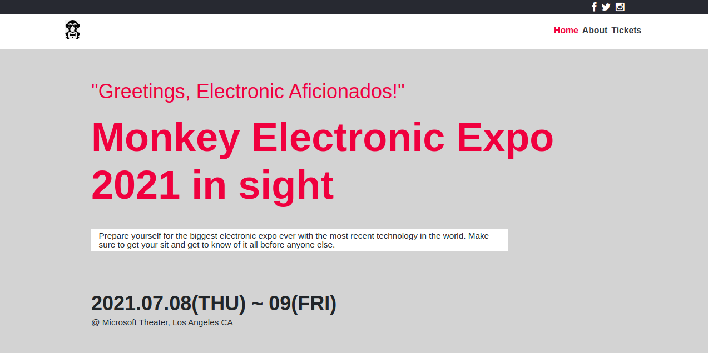

# Conference Capstone

A new design for a made-up expo based on one of Behance's sites. It has different pages in order to find specific information such as what is the expo about, who is comming, some of the history behind the expo, contact info and prices. Monkey Electronic Expo is bringing the head leaders of the biggest electronic companies in the world to present their latest technologies.

## Built With

- HTML
- CSS
- Bootstrap

## Live Demo

[Live Demo Link](https://jarfsoft.github.io/)

## Getting Started

To get a local copy up and running follow these simple example steps.

### Prerequisites

- An operating system such as Windows, MAC, or Linux
- An modern browser such as Google Chrome, Mozilla Firefox, or Microsoft Edge

### Setup
- Clone or download the repo by clicking the green button in the main github page for this sorfware.
- Go to the folder in which you downloaded the repo.
- Find the index.html file and drag it into a browser tab.

### Run tests
- StyleLint
- Webhint
- Lighthouse

## Authors

👤 **Author**

- GitHub: [@Jarfsoft](https://github.com/Jarfsoft)
- Twitter: [@Jarfsoft](https://twitter.com/Janluc123)
- LinkedIn: [LinkedIn](https://www.linkedin.com/in/juan-raudales-flores-7b0a3b113/)

## 🤝 Contributing

Contributions, issues, and feature requests are welcome!

Feel free to check the [issues page](https://github.com/Jarfsoft/Conference-page/issues).

## Show your support

Give a ⭐️ if you like this project!

## Acknowledgements

- [Design](https://www.behance.net/gallery/29845175/CC-Global-Summit-2015) by [Cindy Shin](https://www.behance.net/adagio07)
